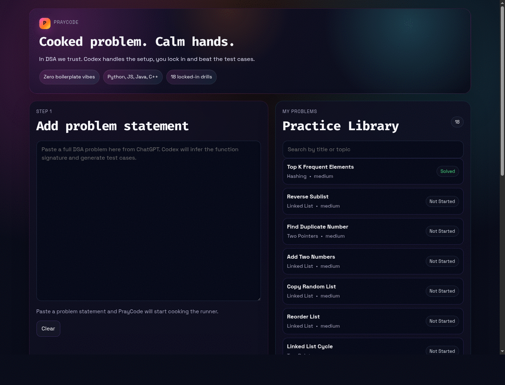
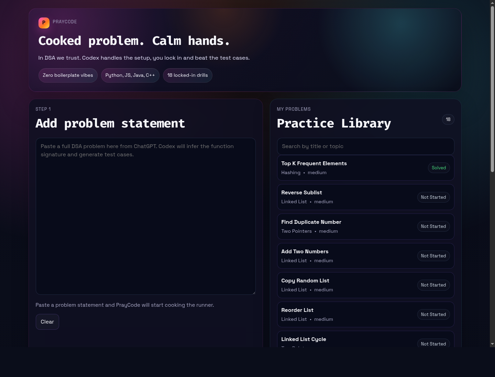
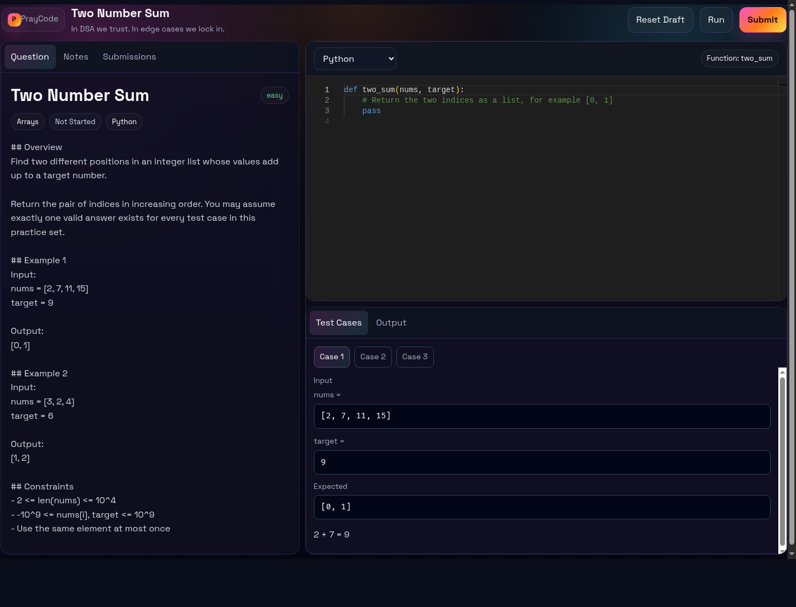

# PrayCode

PrayCode is a personal full-stack DSA practice app for turning raw problem statements into runnable coding drills.

In DSA we trust.

Paste a problem, let Codex generate the starter harness and test cases, then solve it in a local NeetCode-style workspace with run and submit support.

## Demo



## Preview

### Home



### Workspace



## Features

- Paste a raw problem statement into the app
- Let Codex CLI generate the title, function signature, starter code, and test cases
- Review the generated visible test cases before saving
- Store problems in SQLite with topic, difficulty, and status
- Open a dedicated workspace for each saved problem
- Switch between Python, JavaScript, Java, and C++ in the Monaco editor
- Run and submit code against predefined test cases
- See pass/fail output, actual vs expected values, stdout, and runtime errors
- Save code drafts locally in the browser per problem
- Edit workspace notes and similar-question references directly from the problem page
- Review submission history and reload a previous submitted code snapshot
- Start with 5 seeded practice problems immediately

## Why PrayCode

- Fast local practice loop with no heavy platform setup
- AI-assisted problem drafting using the local Codex CLI
- Clean workspace inspired by LeetCode and NeetCode
- Multi-language support for Python, JavaScript, Java, and C++
- Practical support for common DSA shapes such as plain functions, linked lists, and random-pointer linked lists

## Stack

- Frontend: React + Vite + TypeScript
- Backend: FastAPI + SQLAlchemy
- Database: SQLite
- Code editor: Monaco Editor
- Code execution: local subprocess / compile-run flow for Python, JavaScript, Java, and C++ with timeout

## Project Structure

```text
dsa-practice-mvp/
├── backend/
│   ├── app/
│   │   ├── api/routes/
│   │   ├── data/
│   │   ├── db/
│   │   ├── models/
│   │   ├── schemas/
│   │   └── services/
│   ├── scripts/
│   └── requirements.txt
├── frontend/
│   ├── src/
│   │   ├── api/
│   │   ├── components/
│   │   ├── hooks/
│   │   ├── pages/
│   │   └── types/
│   └── package.json
└── README.md
```

## Seeded Problems

- Two Number Sum
- Balanced Brackets
- Binary Search Position
- Best Profit From One Trade
- Contains Duplicate Value

The descriptions are original rewrites rather than copied platform statements.

## Backend API

- `GET /health`
- `GET /problems`
- `POST /problems/generate`
- `GET /problems/{slug}`
- `POST /problems`
- `POST /problems/{slug}/run`
- `POST /problems/{slug}/submit`
- `PATCH /problems/{slug}/status`
- `PATCH /problems/{slug}/workspace`
- `GET /problems/{slug}/submissions`

## Local Setup

Run these commands from the project root:

```bash
cd /mnt/hdd/Job\ Switch/Projects/dsa-practice-mvp
python3 -m venv .venv
.venv/bin/pip install -r backend/requirements.txt
codex login
cd frontend
npm install
```

`codex login` is required for the AI generation step because the backend shells out to the locally installed Codex CLI.

## Running The App

Simplest local setup:

```bash
praycode
```

That starts both services for you from any terminal.

Useful companion commands:

```bash
praycode status
praycode stop
praycode restart
```

If `praycode` is not installed yet on a fresh machine, wire it once with:

```bash
ln -sf '/mnt/hdd/Job Switch/Projects/dsa-practice-mvp/scripts/praycode' ~/.local/bin/praycode
```

Then open a new terminal and just use `praycode`.

What `praycode` starts:

- Frontend: `http://127.0.0.1:5173`
- Backend docs: `http://127.0.0.1:8000/docs`

You can still call the raw scripts directly if you want:

```bash
/mnt/hdd/Job\ Switch/Projects/dsa-practice-mvp/scripts/status_praycode.sh
/mnt/hdd/Job\ Switch/Projects/dsa-practice-mvp/scripts/stop_praycode.sh
```

Logs go to:

- `logs/frontend.log`
- `logs/backend.log`

### Manual Mode

If you still want the old two-terminal setup, start the backend:

```bash
cd /mnt/hdd/Job\ Switch/Projects/dsa-practice-mvp/backend
../.venv/bin/uvicorn app.main:app --host 127.0.0.1 --port 8000
```

Then start the frontend in a second terminal:

```bash
cd /mnt/hdd/Job\ Switch/Projects/dsa-practice-mvp/frontend
npm run dev -- --host 127.0.0.1 --port 5173
```

## Environment Variables

Backend supports:

```bash
DATABASE_URL=sqlite:///./dsa_practice.db
FRONTEND_ORIGIN=http://localhost:5173,http://127.0.0.1:5173
```

Frontend supports:

```bash
VITE_API_BASE_URL=http://localhost:8000
```

## How Code Execution Works

When you click Run or Submit:

1. The frontend sends your selected language and code to the FastAPI backend.
2. The backend loads the problem metadata and test cases from SQLite.
3. It writes your solution and a generated language-specific harness into a temporary directory.
4. The harness loads the submitted code, looks up the configured function, and runs each test case.
5. The backend captures:
   - returned output
   - stdout
   - runtime errors
   - full pass/fail comparison
6. Compiled languages are built first, then executed.
7. The subprocess is terminated if it exceeds the timeout.

`Run` uses visible test cases. `Submit` uses visible plus hidden test cases when hidden cases exist.

## Product Flow

1. Open the home page.
2. Paste a DSA problem statement into the large textbox.
3. Wait for the draft to auto-generate after you stop typing.
4. Review the generated title, function name, and visible test cases.
5. Click `Save And Open`.
6. Pick a language and use `Run` or `Submit`.

## Screens At A Glance

- Home page: paste a problem, preview generated visible tests, save and open
- Workspace: left problem pane, center editor, bottom test/output runner
- Notes and submissions: quick scratchpad plus submission history per problem

## Verification Done

These checks were completed during implementation:

- Backend Python source compiled successfully with `../.venv/bin/python -m compileall app`
- Frontend production build completed successfully with `npm run build`
- Backend execution was verified directly for Python, JavaScript, Java, and C++ against `contains-duplicate-value`, with all 4 runtimes returning passing results
- Linked-list execution was verified directly for Python, JavaScript, Java, and C++ against `reverse-linked-list`, with all 4 runtimes returning passing results
- Live localhost verification passed for `GET /health`, `GET /problems`, and `POST /problems/two-number-sum/run`
- Live Codex generation verification passed for `POST /problems/generate`
- Live frontend verification passed in headless Chrome for `/` and `/problems/two-number-sum`
- Live workspace note saving passed through `PATCH /problems/two-number-sum/workspace`
- Live submission history persistence passed through `POST /problems/two-number-sum/submit` followed by `GET /problems/two-number-sum/submissions`

If you want to verify the live localhost flow manually after starting both apps:

1. Open the dashboard
2. Open `Two Number Sum`
3. Keep or edit the starter solution
4. Pick a language from the editor toolbar
5. Click `Run`
6. Confirm case-by-case results appear in the bottom runner panel

## Known Limitations

- Only Python, JavaScript, Java, and C++ are supported right now
- Local subprocess execution is timeout-limited but not container-isolated
- No authenticated users or multi-user support
- Drafts are stored in browser localStorage, not the backend
- Generated starter code and signature inference are optimized for common DSA-style functions, not arbitrary project code

## Future Improvements

- Add per-user accounts and synced drafts
- Add richer submission analytics and runtime snapshots
- Add richer hidden test case controls
- Add safer execution sandboxing with containers or OS-level isolation
- Add Kotlin, Go, Rust, C#, and Swift runtimes if you want broader language coverage
